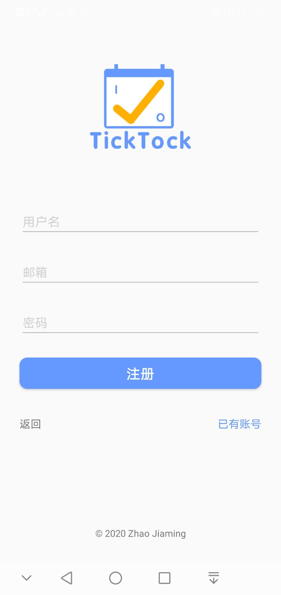
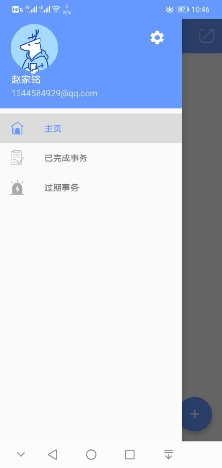
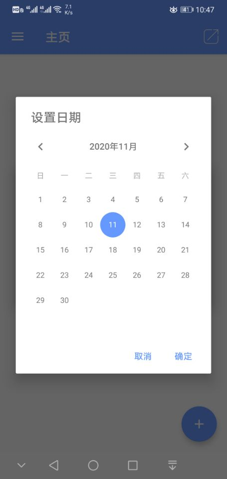
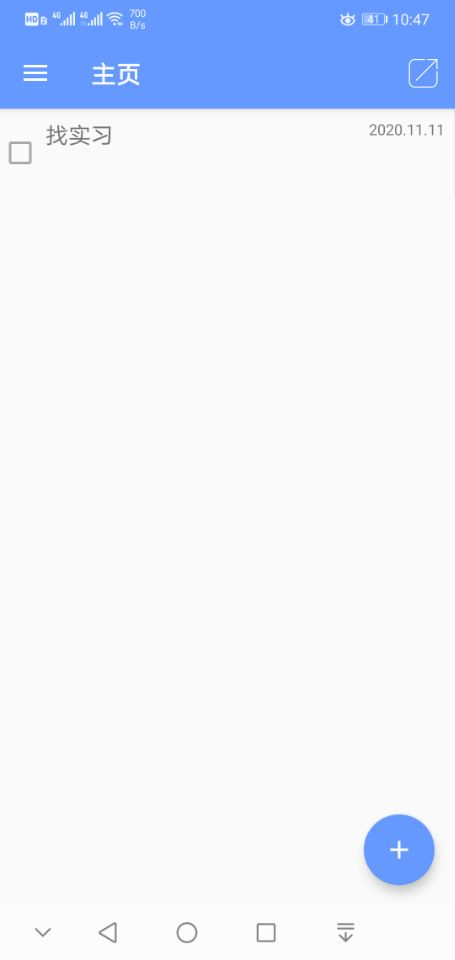
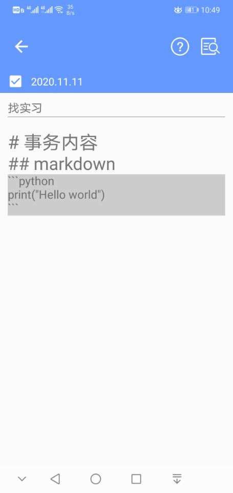
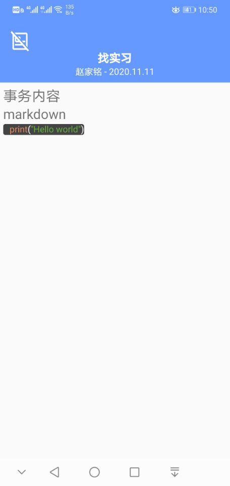
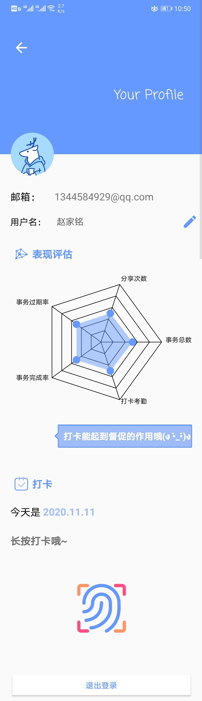
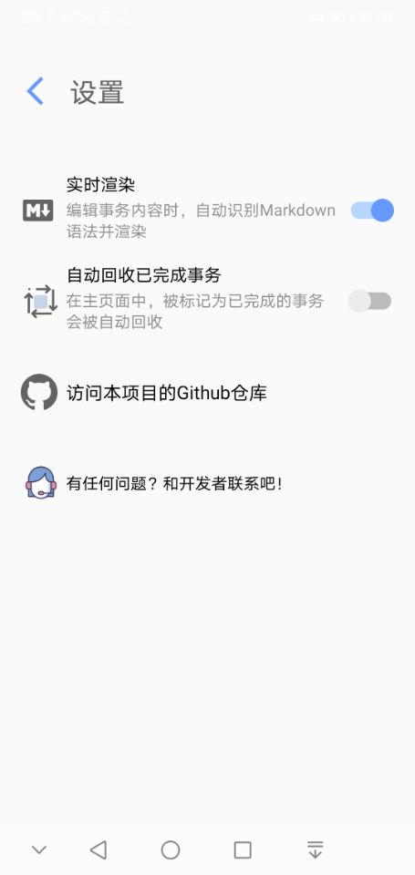

# TT (TickTock)
> 我的第一款Android应用（Web branch）

This App is **For Learn & Communication Purposes Only**.

## Open Source [#](#)
Under MIT License.
- 客户端代码: [GitHub Repo](https://github.com/githubzjm/TT)
- 服务端代码: [GitHub Repo](https://github.com/githubzjm/TT/tree/web/tt-server)

## Download APK [#](#)
- Android 5.0 (Lollipop) +
    > minSdkVersion: 21

|Type|Version|Time|Description|
|--|--|--|--|
|Debug|[v1.2.0](http://www.zjmpage.com/TT/TT_debug1.2.0.apk)|*2020.10.05*|web version|
|||

## UI

## TODO List [#](#)
- [ ] 设置时间、铃声、重复提醒
- [ ] 桌面控件
- [ ] 状态栏推送提醒

## Note
- **必须联网打开**，否则会直接闪退（目前只是实现功能，代码还不完善）